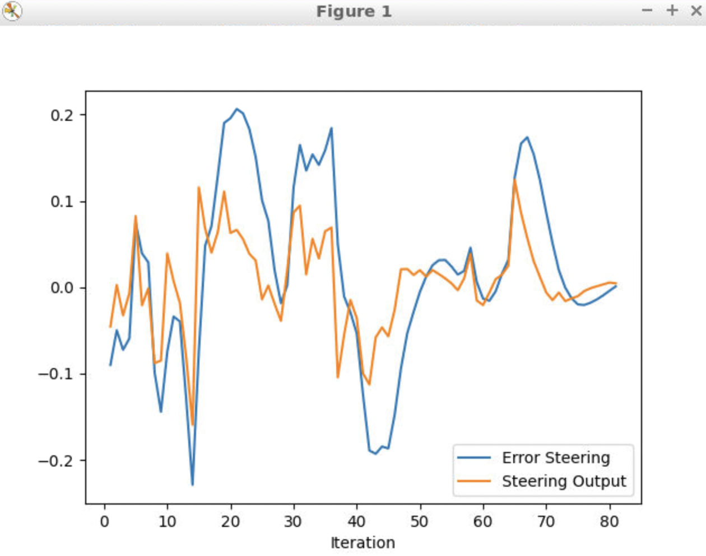
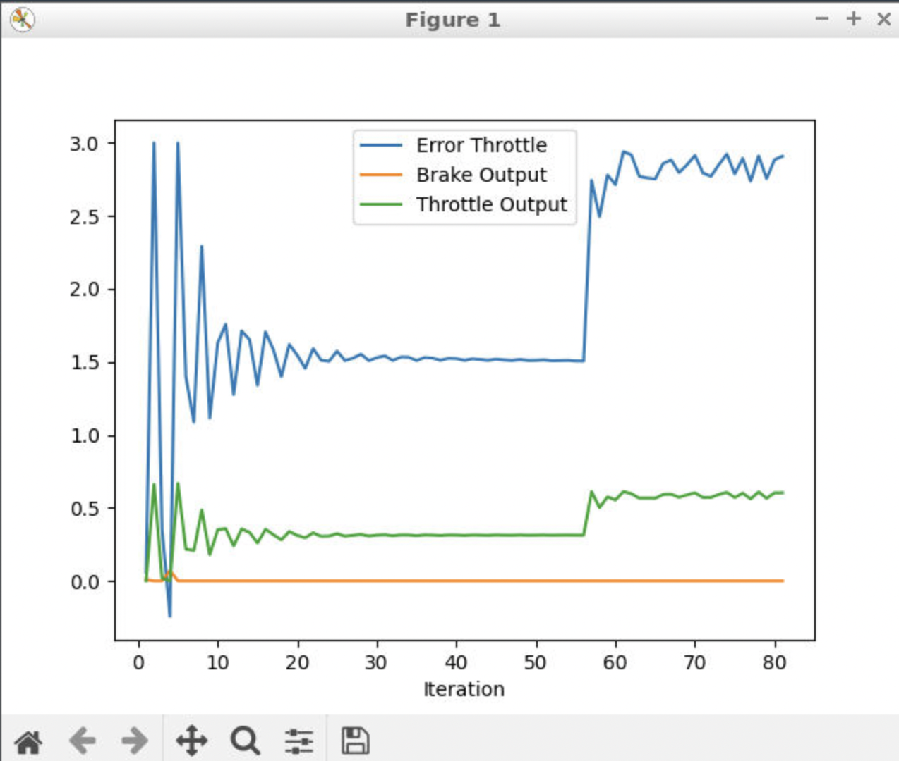
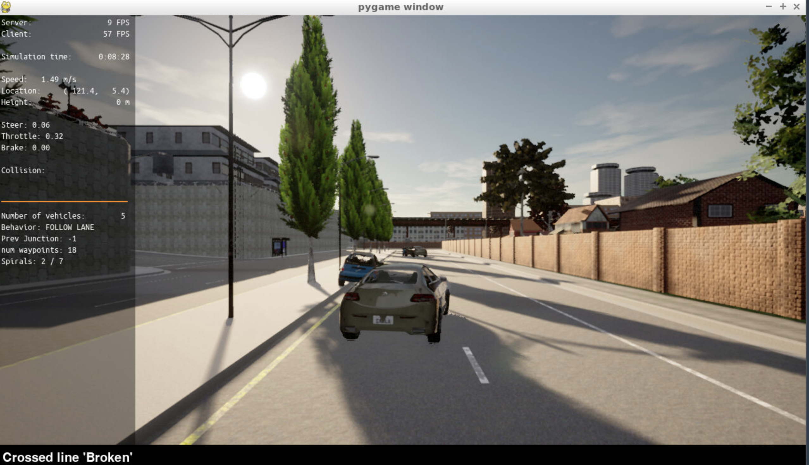

# Control and Trajectory Tracking for Autonomous Vehicle

# Proportional-Integral-Derivative (PID)

In this project, you will apply the skills you have acquired in this course to design a PID controller to perform vehicle trajectory tracking. Given a trajectory as an array of locations, and a simulation environment, you will design and code a PID controller and test its efficiency on the CARLA simulator used in the industry.

### Installation

Run the following commands to install the starter code in the Udacity Workspace:

Clone the <a href="https://github.com/udacity/nd013-c6-control-starter/tree/master" target="_blank">repository</a>:

`git clone https://github.com/udacity/nd013-c6-control-starter.git`

## Run Carla Simulator

Open new window

- `su - student`
  // Will say permission denied, ignore and continue
- `cd /opt/carla-simulator/`
- `SDL_VIDEODRIVER=offscreen ./CarlaUE4.sh -opengl`

## Compile and Run the Controller

Open new window

- `cd nd013-c6-control-starter/project`
- `./install-ubuntu.sh`
- `cd pid_controller/`
- `rm -rf rpclib`
- `git clone https://github.com/rpclib/rpclib.git`
- `cmake .`
- `make` (This last command compiles your c++ code, run it after every change in your code)

## Testing

To test your installation run the following commands.

- `cd nd013-c6-control-starter/project`
- `./run_main_pid.sh`
  This will silently fail `ctrl + C` to stop
- `./run_main_pid.sh` (again)
  Go to desktop mode to see CARLA

If error bind is already in use, or address already being used

- `ps -aux | grep carla`
- `kill id`

## Project Instructions

In the previous project you built a path planner for the autonomous vehicle. Now you will build the steer and throttle controller so that the car follows the trajectory.

You will design and run the a PID controller as described in the previous course.

In the directory [/pid_controller](https://github.com/udacity/nd013-c6-control-starter/tree/mathilde/project_c6/project/pid_controller) you will find the files [pid.cpp](https://github.com/udacity/nd013-c6-control-starter/tree/mathilde/project_c6/project/pid_controller/pid.cpp) and [pid.h](https://github.com/udacity/nd013-c6-control-starter/tree/mathilde/project_c6/project/pid_controller/pid.h). This is where you will code your pid controller.
The function pid is called in [main.cpp](https://github.com/udacity/nd013-c6-control-starter/tree/mathilde/project_c6/project/pid_controller/main.cpp).

### Step 1: Build the PID controller object

Complete the TODO in the [pid_controller.h](https://github.com/udacity/nd013-c6-control-starter/tree/mathilde/project_c6/project/pid_controller/pid_controller.h) and [pid_controller.cpp](https://github.com/udacity/nd013-c6-control-starter/tree/mathilde/project_c6/project/pid_controller/pid_controller.cpp).

Run the simulator and see in the desktop mode the car in the CARLA simulator. Take a screenshot and add it to your report. The car should not move in the simulation.

### Step 2: PID controller for throttle:

1. In [main.cpp](https://github.com/udacity/nd013-c6-control-starter/tree/mathilde/project_c6/project/pid_controller/main.cpp), complete the TODO (step 2) to compute the error for the throttle pid. The error is the speed difference between the actual speed and the desired speed.

Useful variables:

- The last point of **v_points** vector contains the velocity computed by the path planner.
- **velocity** contains the actual velocity.
- The output of the controller should be inside [-1, 1].

2. Comment your code to explain why did you computed the error this way.

3. Tune the parameters of the pid until you get satisfying results (a perfect trajectory is not expected).

### Step 3: PID controller for steer:

1. In [main.cpp](https://github.com/udacity/nd013-c6-control-starter/tree/mathilde/project_c6/project/pid_controller/main.cpp), complete the TODO (step 3) to compute the error for the steer pid. The error is the angle difference between the actual steer and the desired steer to reach the planned position.

Useful variables:

- The variable **y_points** and **x_point** gives the desired trajectory planned by the path_planner.
- **yaw** gives the actual rotational angle of the car.
- The output of the controller should be inside [-1.2, 1.2].
- If needed, the position of the car is stored in the variables **x_position**, **y_position** and **z_position**

2. Comment your code to explain why did you computed the error this way.

3. Tune the parameters of the pid until you get satisfying results (a perfect trajectory is not expected).

### Step 4: Evaluate the PID efficiency

The values of the error and the pid command are saved in thottle_data.txt and steer_data.txt.
Plot the saved values using the command (in nd013-c6-control-refresh/project):

```
python3 plot_pid.py
```

You might need to install a few additional python modules:

```
pip3 install pandas
pip3 install matplotlib
```

### Answer the following questions:

- Add the plots to your report and explain them (describe what you see)

  - The steering plot illustrates the correlation between steering error and steering output. Notably, the error curve demonstrates a low-frequency oscillation, which signifies the existence of complex conjugate eigenvalues within the closed-loop transfer function. Consequently, this observation implies that the trajectory remains comparatively smooth, despite the presence of oscillatory patterns
    

  - The throttle plot illustrates the velocity control. Notably, the urban surroundings, this speed is hard to reach especially to avoid the collisions. Error throttle increases, it means that there is a larger difference between the desired speed or acceleration and the actual speed or acceleration of the vehicle.
    

- What is the effect of the PID according to the plots, how each part of the PID affects the control command?

  - **Proportional (P) Term**

    - Responds to current error between desired and actual states.
    - Higher gain leads to stronger response and faster error reduction.
    - Excessive gain can cause overshoot and oscillation.

  - **Integral (I) Term**

    - Considers cumulative sum of past errors to eliminate steady-state errors.
    - Acts as long-term correction component to reduce biases and offset.
    - Increasing gain strengthens error elimination but may introduce oscillations.

  - **Derivative (D) Term**
    - Considers rate of change of error to dampen response to sudden changes.
    - Anticipates error trends and aids system stabilization.
    - Higher gain provides faster response and reduces overshoot.
    - Excessive gain can amplify noise or introduce instability.

  **Overall:** Proportional term provides immediate response, integral term eliminates steady-state errors, and derivative term dampens response to changes. Proper PID gain tuning is crucial for stability, desired response time, and minimal overshoot in self-driving car control.

- How would you design a way to automatically tune the PID parameters?

  Automatic PID parameter tuning streamlines achieving desired control performance without manual intervention. It is valuable for optimizing self-driving cars and other dynamic systems.

  - **Step 1: Initial Parameter Selection**

    - Set initial values for PID parameters (P, I, and D) based on prior knowledge or defaults.

  - **Step 2: Define Objective Function**

    - Determine an objective function that quantifies control system performance.

  - **Step 3: Select a Tuning Method**

    - Choose an automatic tuning method suitable for the system (e.g., Ziegler-Nichols, Cohen-Coon, or gradient-based algorithms).

  - **Step 4: Apply Tuning Algorithm**

    - Implement the selected tuning method to iteratively adjust PID parameters.

  - **Step 5: Evaluation and Validation**

    - Evaluate performance using simulation or real-world testing.
    - Assess system stability, response time, and minimal overshoot.

  - **Step 6: Iterate and Refine**
    - Fine-tune parameters or try alternative tuning methods if needed.
    - Continuously refine until desired control performance is achieved.

- PID controller is a model free controller, i.e. it does not use a model of the car. Could you explain the pros and cons of this type of controller?

  - **Pros:**

    - **Simplicity:** PID control is conceptually simple and easy to implement.
    - **Real-Time Adaptation:** It can adapt to changes in the system dynamics without requiring a precise model.
    - **Widely Applicable:** PID control is versatile and can be applied to various systems and processes.
    - **Efficiency:** PID controllers can provide fast and responsive control in real-time scenarios.
    - **Tried and Tested:** PID control has a long history of successful applications and practical use.

  - **Cons:**
    - **Limited Performance:** PID control may struggle with complex, nonlinear systems or those with significant disturbances.
    - **Difficulty with System Changes:** PID controllers may require re-tuning or adjustment when system parameters change.
    - **Lack of Robustness:** PID control is sensitive to parameter variations and uncertainties in the system.
    - **Inability to Handle Delays:** PID control cannot effectively handle time delays in the system.
    - **Limited Adaptability:** PID controllers may not perform optimally in situations that require complex control strategies.

- (Optional) What would you do to improve the PID controller?

### Simulation Figures:




